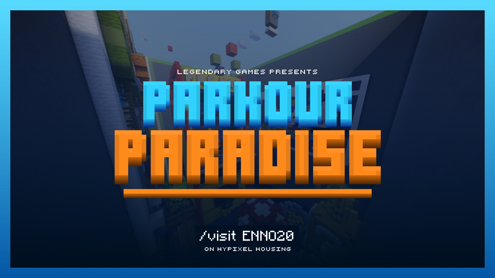
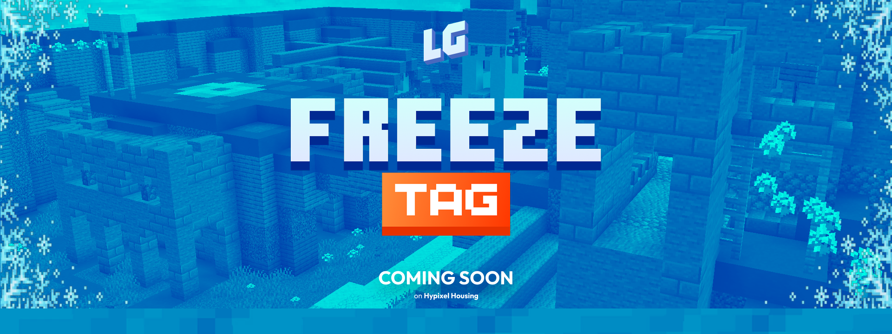

**Pushing the boundaries of [Hypixel Housing](https://hypixel.net).**

Legendary Games is a community of designers, builders, and developers creating games within Hypixel Housing. Founded on September 4th, 2023, we've grown into one of Housing's most active creative groups — with **40+ games released**, **20+ events hosted**, and **70+ creators & staff** contributing to our projects.

We build houses, the tools to make them, and infrastructure behind it all.

---

## Some Games

<table>
  <tr>
    <td width="50%"></td>
    <td width="50%"></td>
  </tr>
  <tr>
    <td align="center"><b>Parkour Paradise</b> <code>/visit ENN020</code></td>
    <td align="center"><b>Freeze Tag</b> Coming soon</td>
  </tr>
</table>

...and many more, with new releases and events all the time.

---

## Projects

| Repository | Description |
|---|---|
| **LG-Website** | Our main platform — a React + Node.js monorepo powering house browsing, player stats, profiles, live chat, news, and game-specific tools. Visit it at [legendarygames.dev](https://legendarygames.dev). |
| **htsw** | A refined HTSL parser, LSP framework, simulator, and importer/exporter. Includes a CLI, VSCode extension, and in-game overlay for syncing code directly into Housing. |
| **docs** | Internal documentation covering Housing mechanics, HTSL/HTSW language reference, and contributor guides. |

Plus more private tooling for light-speed housing development!

## What is HTSL?

HTSL (Housing Text Scripting Language) created by [BusterBrown1218](https://github.com/BusterBrown1218/HTSL) is a text-based language for programming Hypixel Housing - replacing manual GUI clicking with readable, version-controlled code. **HTSW** is our evolution of that language, adding a stricter type system, better project organization, smart importer with diffing, a simulator, and full IDE support so creators can write, test, and deploy Housing logic from their editor.

---

## Admin Team

- **Chinkn** ([@chikn8](https://github.com/chikn8)) Owner @ Legendary Games
- **Callan** ([@callanftw](https://github.com/callanftw)) Co-Owner @ Legendary Games
- **Cloud** ([@MelanCloud](https://github.com/MelanCloud)) Co-Owner @ Legendary Games
- **Jesse** ([@69Jesse](https://github.com/69Jesse)) Admin @ Legendary Games
- **Terra** ([@terraidk](https://github.com/terraidk)) Admin @ Legendary Games
- **Cyborg** ([@Cybcrg](https://github.com/Cybcrg)) Admin @ Legendary Games

---

## Get Involved

We're always looking for talented builders, developers, and creators. Whether you want to bring a game idea to life or contribute to our tools, there's a place for you.

- **Website** — [legendarygames.dev](https://legendarygames.dev)
- **Discord** — [discord.gg/whYMAkK3vC](https://discord.gg/whYMAkK3vC)
